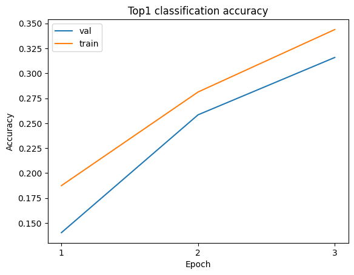
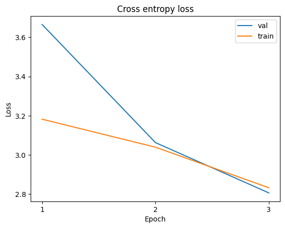

# CORnet-100
### Installation and Setup
1. Run the following commands to create and setup the conda environment for CORnet
```bash
conda create -n cornet python=3.7
git clone https://github.com/chanelfcheng/CORnet-100.git
cd CORnet-100
python -m pip install -e .
```
2. For plotting tools and jupyter notebook, additionally run the following command
```bash
python -m pip install matplotlib ipykernel
```
3. Download the MiniImageNet dataset from Kaggle and rename the `test` directory
   to `val`:
   https://www.kaggle.com/datasets/ctrnngtrung/miniimagenet/data

### Run Commands
- To train a model with no feedback connection (`outer_times` determines how
  many times the V1 to V4 path is run, so with no feedback
  connection this is just `1`):
```bash
python run.py train --model S100 --workers 6 --ngpus 1 --step_size 20 --epochs 43 --lr .1 --batch_size 16 --outer_times 1 --data_path ../MiniImageNet/ --output_path exp_name/
```
- To train a model with a feedback connection with 1 recurrent iteration:
```bash
python run.py train --model S100 --workers 6 --ngpus 1 --step_size 20 --epochs 43 --lr .1 --batch_size 16 --outer_times 2 --data_path ../MiniImageNet/ --output_path exp_name/
```
- To train a model with a feedback connection with 2 recurrent iterations:
```bash
python run.py train --model S100 --workers 6 --ngpus 1 --step_size 20 --epochs 43 --lr .1 --batch_size 16 --outer_times 3 --data_path ../MiniImageNet/ --output_path exp_name/
```
- To train a model with a feedback connection with 3 recurrent iterations:
```bash
python run.py train --model S100 --workers 6 --ngpus 1 --step_size 20 --epochs 43 --lr .1 --batch_size 16 --outer_times 4 --data_path ../MiniImageNet/ --output_path exp_name/
```
- To evaluate a model:
```bash
python run.py test --model S100 --batch_size 16 --ckpt_path /path/to/ckpt.pth.tar --data_path /path/to/image/folder/ --output_path output_dir/
```

### Dataset Information
- The dataset originally used to train the model was ImageNet LSVRC 2012, which contains a variety of images of objects, animals, scenes, etc.
	- **Training data:** 138 GB, ~1.2 million images 
	- **Validation data:** 12.6 GB, ~300 thousand images
- We are using the smaller MiniImageNet in order to make training the model feasible on the ICL6
	- **Training data:** 5.6 GB, ~50 thousand images
	- **Validation data:** 1.1 GB, ~10 thousand images

### Data File Organization
- Data should be downloaded with the top directory being `MiniImageNet` -- hence the path is `../MiniImageNet` relative to the project's `run.py` script
- Within `MiniImageNet`, there should be two directories: `train`, and `val` which contains training and validation data respectively.
- Within each subdirectory `train` and `val`, there should be several folders denoting each class in the dataset that start with `n` followed by a string of numbers
- Within each `n` directory, there are images belonging to that particular class

### Data Pre-Processing
- The images are pre-processed before being used to train the models
	- Resizes images to consistent resolution and shape of 224 x 224 x 3
	- Applies augmentations to the data such as random cropping and horizontal flipping

### Example Data
- Here is one example image from the dataset:
	- 
- Here is an example image that had an transformation (random crop and horizontal flipping) applied to it:
	- 

### Visualizations
- The code does not provide visualizations of the data, which are already viewable as images
- The code also does not provide visualization for the feature embedding space
- The top-1 accuracies can be plotted as a function of the training epochs to track the model's learning progress:
	- 
- The losses can similarly be plotted as a function of the training epochs:
	- 
- After more experiments are run, we could also plot final accuracies and brain-scores as a function of the learning rate used for training.

### Metrics
- The evaluation metric is *MiniImageNet top-1 accuracy*
	- **top-1 accuracy:** The class prediction is taken as output class
	with the highest probability in the model. To evaluate accuracy, each class
	prediction is compared against the true label. Top-1 accuracy is the
	percentage of correct predictions out of the total number of predictions made.

### Additional Program Output
- Below shows command line output from training the model for 2 epochs (0th one is before any training happens)
```bash
(cornet) cfc6715@fell:~/Courses/CSCI335/Project/CORnet$ python run.py train --model S100 --workers 6 --ngpus 1 --step_size 20 --epochs 43 --lr .1 --batch_size 16 --outer_times 1 --data_path ../MiniImageNet/ --output_path exp_baseline/
Start training

train: {'loss': 4.837890148162842, 'top1': 0.0, 'top5': 0.03125, 'learning_rate': 0.1, 'dur': 44.56482768058777, 'data_load_dur': nan}

val: {'loss': 103.41341944880429, 'top1': 0.01, 'top5': 0.0488, 'dur': 0.14026101987073375}

train: {'loss': 4.178096771240234, 'top1': 0.0625, 'top5': 0.15625, 'learning_rate': 0.1, 'dur': 0.4530346393585205, 'data_load_dur': 0.00045180320739746094}

val: {'loss': 4.074840762329101, 'top1': 0.0838, 'top5': 0.2754, 'dur': 0.12932536556462573}

train: {'loss': 3.1822123527526855, 'top1': 0.1875, 'top5': 0.53125, 'learning_rate': 0.1, 'dur': 0.14090704917907715, 'data_load_dur': nan}

val: {'loss': 3.6653279426574708, 'top1': 0.1404, 'top5': 0.3782, 'dur': 0.13012232901943718}

train: {'loss': 3.424914836883545, 'top1': 0.1875, 'top5': 0.34375, 'learning_rate': 0.1, 'dur': 0.4545159339904785, 'data_load_dur': 0.00043582916259765625}

val: {'loss': 3.282041403961182, 'top1': 0.207, 'top5': 0.476, 'dur': 0.1293046793360619}

train: {'loss': 3.0393784046173096, 'top1': 0.28125, 'top5': 0.5, 'learning_rate': 0.1, 'dur': 0.14285731315612793, 'data_load_dur': nan}

val: {'loss': 3.0628765789031984, 'top1': 0.2584, 'top5': 0.538, 'dur': 0.12939991465040074}

train: {'loss': 2.985222339630127, 'top1': 0.15625, 'top5': 0.5625, 'learning_rate': 0.1, 'dur': 0.453869104385376, 'data_load_dur': 0.000576019287109375}

val: {'loss': 2.939142420196533, 'top1': 0.2842, 'top5': 0.5728, 'dur': 0.12931717125473507}

train: {'loss': 2.832486391067505, 'top1': 0.34375, 'top5': 0.59375, 'learning_rate': 0.1, 'dur': 0.1426398754119873, 'data_load_dur': nan}

val: {'loss': 2.806280549240112, 'top1': 0.3158, 'top5': 0.6018, 'dur': 0.12972281692893642}
...
```